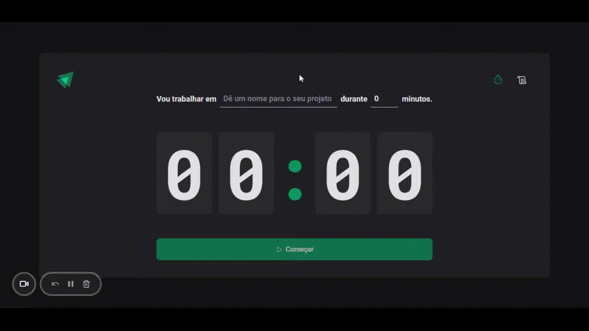

# Ignite - Countdown

## 📋 Table of contents

- [About](#about)
- [Step by step to use the application](#step-by-step-to-use-the-application)
- [Built with](#built-with)
- [Author](#author)

## 📃 About

This project is a counter in which the user chooses a title for the activity he is going to perform and chooses the time he wants, between 5 in 60 minutes.

With it, the user will be able to time the time spent performing an activity, helping to maintain focus. In addition, the user has access to the history of activities and times they have previously performed, along with the status of “Completed”, “Interrupted” and “In Progress” of each counter.



## 🚀 Step by step to use the application

1 - Install the dependencies:

```
  npm install
```

2 - Run de web aplication in development mode:

```
  npm run dev
```

## 🔧 Built with

- [React JS](https://pt-br.reactjs.org/)
- [Typescript](https://www.typescriptlang.org/)
- [Styled-components](https://styled-components.com/)
- [React-router](https://reactrouter.com/en/main)

## 🤵 Author

- [LinkedIn](https://www.linkedin.com/in/kevenpacheco/)
